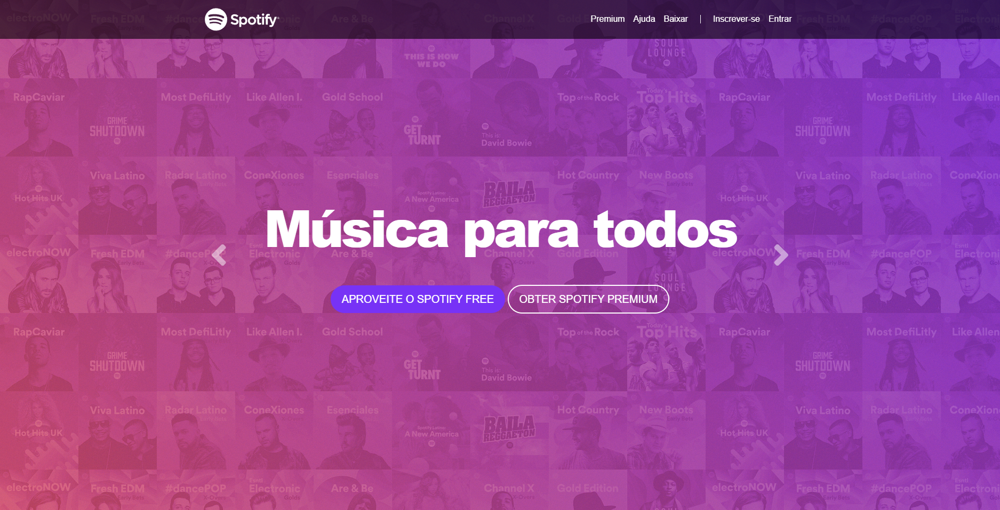
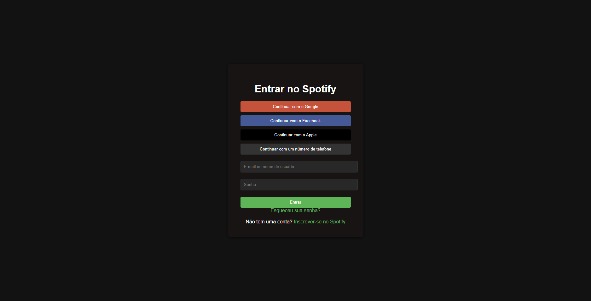

# 🎵 Spotify Clone

Projeto de clone da interface do Spotify, desenvolvido com HTML, CSS e Bootstrap.

## 📄 Páginas

- **index.html** — Página inicial com navbar, carousel, seção de serviços, recursos e rodapé
- **loguin.html** — Tela de login com opções de acesso por redes sociais e e-mail/senha

## 🛠️ Tecnologias

- HTML5
- CSS3
- Bootstrap 4
- Font Awesome

## 📸 Telas

### Página Inicial

### Login

